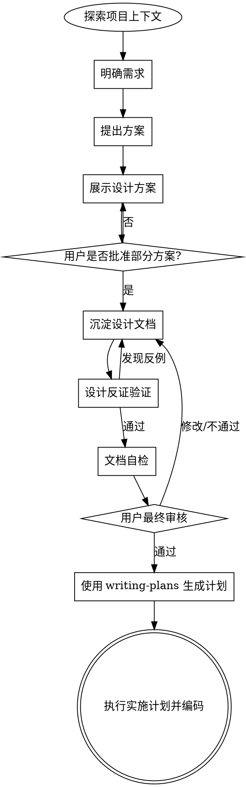

# 核心理念

通过自然的协作对话，将输入的想法转化为完整的设计方案。
**反模式警告**：绝不存在“太简单不需要设计”的项目。无论是单功能小工具还是简单的配置修改，隐藏的默认假设极易导致返工。
**铁律**：在方案展示并得到用户最终批准之前，**绝对禁止**调用实施技能、编写代码或搭建项目。

---

# 标准工作流 (Workflow)

严格按照以下顺序串行执行，每一个环节都必须建立在上一个环节确定的基础之上。
开始时必须声明：“我正在使用 `brainstorming` skill 创建设计文档。”

### 1. 探索项目上下文（ReAct 探索循环）

**不要一次性读完所有文件**。采用 ReAct 循环，每次读取基于上一步的发现：

```
入口文件/报错位置
  → Observe：读取，记录关键发现（依赖、引用、数据结构）
  → Reason：这个发现意味着什么？还需要看哪些关联文件？
  → Act：根据判断选择下一个文件继续读
  → 循环，直到对需求落地点有清晰认知
```

每轮探索后更新"当前认知"：

```
已知：[当前确认的架构事实]
待确认：[还需要读哪些文件，以及为什么]
```

**退出条件**：必须能回答以下问题后才能进入方案设计：
- 新需求的代码要写在哪里，会影响哪些现有模块？
- 相关入口、核心模块、数据结构、外部依赖和副作用分别是什么？
- 当前代码中每个相关模块承担什么职责，哪些职责会被迁移、删除、保留或新增？
- 是否存在输入输出、状态流转、错误处理、权限边界、性能约束、兼容性等隐含契约？
- 至少列出 3 条真实使用路径或执行路径，并能说明当前行为和新方案下的期望行为。

**固定检查点**（在 ReAct 循环之外，每次必做）：
- 检查根目录是否存在 `ytt.config.ts`。若存在，判定项目使用 `@zcy/yapi-to-typescript`，后续 API 设计**必须**遵循 `loong-claude:yapi-guide` skill 规则。
- 查看近期提交了解当前迭代方向：`git log --oneline -5`
- **规模防范**：若需求包含多个庞大子系统，必须引导用户拆分为独立子项目。

### 2. 明确需求（自适应提问）

**单次单问**：每次只问一个问题，不列问题清单。

**自适应原则**：根据上一个回答动态决定下一个问题，而不是按预设顺序提问。判断逻辑：

```
上一个回答揭示了新的不确定性？
  是 → 下一问针对这个不确定性
  否 → 判断当前信息是否足够推导出方案
       足够 → 进入步骤 3（提出方案）
       不够 → 找出最关键的缺口，针对性提问
```

* **选项优先**：尽量提供多选题替代开放式提问。
* **明确目标**：逐步摸清用户目标、约束条件及成功标准。

### 3. 提出方案 (Propose Options)
* **2-3 种选择**：分析每种方案的优缺点（trade-offs），并明确给出推荐方案及理由。
* **极致简化 (YAGNI)**：无情剔除当前不必要的功能，只做必须做的设计。

### 4. 展示与确认 (Present & Verify)
* **增量展示**：按复杂度拆分展示（简单部分略写，复杂逻辑详述 200-300 字）。涵盖架构、组件、数据流等。
* **即时确认**：每展示一个关键部分，必须获得用户确认后方可继续。遇到歧义立即澄清。

### 5. 沉淀设计文档 (Write Spec)
* 保存路径：`.claude/loong-claude/spec/YYYY-MM-DD-<topic>-design.md`。
* **注意**：该设计文档仅作记录，**不需要** commit 到 Git 仓库。

### 6. 设计反证验证 (Design Falsification)
在交由用户审核前，必须主动尝试推翻当前设计。若发现任一反例成立，必须先修改设计文档，再重新执行本步骤。

#### 6.1 现状契约表
设计文档必须包含现状契约表，记录旧代码已经承担的职责，避免迁移时遗漏隐含副作用。表格字段可根据需求领域调整，但必须覆盖“当前行为、依赖方、风险”三类信息：

| 文件/模块 | 当前职责 | 关键输入/输出/副作用 | 被谁依赖 | 变更风险 |
| --- | --- | --- | --- | --- |
| 示例：模块 A | 示例：解析输入并生成结果 | 示例：读取配置 / 写缓存 / 调用外部服务 | 示例：模块 B / 用户流程 C | 示例：行为变化会破坏兼容性 |

#### 6.2 职责迁移表
设计文档必须说明每个旧职责在新方案中的去向：

| 旧职责 | 原位置 | 新位置 | 处理方式 | 兜底策略 |
| --- | --- | --- | --- | --- |
| 示例：输入校验 | 示例：模块 A | 示例：模块 B 或保留原位置 | 示例：迁移/保留/删除 | 示例：异常时保持旧行为 |

处理方式只能使用：`保留`、`迁移`、`删除`、`新增`。选择 `删除` 时必须说明为什么不再需要，以及谁不再依赖它。

#### 6.3 关键场景矩阵
设计文档必须包含关键场景矩阵，用真实使用路径或执行路径验证方案。矩阵字段可按需求领域调整，但必须覆盖正常路径、失败路径、边界路径和兼容路径：

| 场景 | 触发条件 | 期望行为 | 依赖数据/状态 | 副作用 | 失败兜底 | 验证方式 |
| --- | --- | --- | --- | --- | --- | --- |
| 示例：正常输入 + 依赖可用 | 示例：用户执行流程 A | 示例：返回新结果 | 示例：配置 / 接口 / 本地状态 | 示例：写缓存 / 发事件 | 示例：保持旧结果或提示错误 | 示例：单测 / 手测路径 |

按需选择以下领域检查项，只有命中对应领域时才必须覆盖：
- **前端状态/路由/缓存**：URL 参数、缓存命中/失效、loading、empty、error、页面跳转、重复请求。
- **接口/数据流**：请求成功、请求失败、超时、空数据、脏数据、并发、重试、幂等。
- **权限/安全**：未登录、无权限、越权访问、敏感数据暴露、服务端校验。
- **数据写入/迁移**：旧数据兼容、重复执行、回滚、部分失败、并发写入。
- **任务/流程编排**：步骤跳过、顺序变化、中断恢复、重复触发、下游失败。
- **UI/交互**：初始态、加载态、错误态、空态、禁用态、移动端或窄屏。
- **性能/资源**：大数据量、频繁触发、内存/CPU、网络开销、缓存策略。

若某类检查项不适用，不需要在设计文档中逐项解释；只需要保证矩阵覆盖当前需求真实存在的高风险场景。

#### 6.4 反例审查
必须主动构造至少 3 个可能推翻方案的反例，并逐一回答。反例应来自真实使用路径、旧代码隐含契约、边界输入或外部依赖失败，而不是凭空假设：
- 关键依赖不可用时，方案是否仍有明确行为？
- 移除或迁移旧职责后，是否有调用方依赖这个旧行为？
- 新职责是否导致重复执行、状态不同步、顺序错误或兼容性问题？
- 边界输入、空数据、异常数据是否会产生错误结果？
- 权限、配置、环境差异是否会改变方案结论？
- 用户从非主路径进入时，是否还能完成目标？

#### 6.5 受影响范围清单
涉及公共模块、跨页面流程、共享状态、接口协议、权限、数据写入、构建配置、运行时环境或外部服务的设计，必须列出受影响页面/模块/流程清单，并写明每项的期望行为和验证方式。

### 7. 文档自检 (Self-Review)
在交由用户审核前，快速复盘：
* 清理所有占位符（TBD / TODO）及模糊描述。
* 确保上下文逻辑一致，没有矛盾。
* 确认当前范围足够聚焦，适合单次实施计划。
* 确认设计反证验证已经写入设计文档，而不是只在对话中口头检查。

### 8. 用户最终审核 (User Review Gate)
* **固定话术**：“技术规范已编写并提交至 `<路径>`。请您审阅，在开始制定实施计划之前，如果您有任何需要修改的地方，请随时告知。”
* **阻断点**：让用户选择是否审核通过。若需修改则返回更新并重新自检；只有获得明确批准，方可进入下一步。

### 9. 进入实施阶段 (Implementation)
* 获得授权后，立即使用 `loong-claude:writing-plans` 技能生成详细实施计划，并开始编写代码。

---

# 架构与设计规范

在构思方案时，必须遵循以下技术准则：

* **隔离性与黑盒原则**：将系统拆分为职责单一的小单元。单元应做到“无须阅读内部实现即可知晓用途”。文件过大是功能过载的危险信号。
* **尊重既有代码**：深入理解并遵循现有代码结构与风格。
* **克制的重构**：若现有代码严重阻碍当前任务，可将针对性重构列入方案并解释原因；**坚决拒绝**与当前目标无关的大规模重构。

---

# 工作流图示


