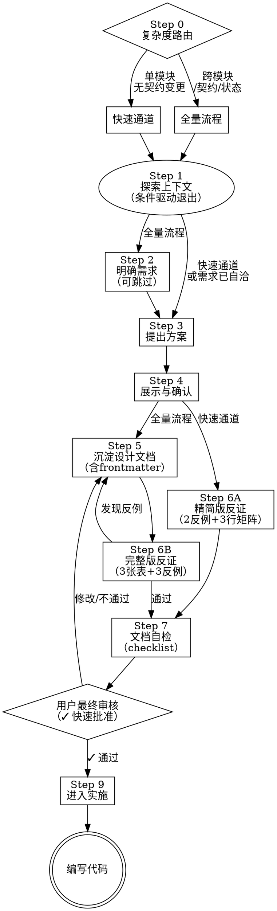

# 核心理念

通过自然的协作对话，将输入的想法转化为完整的设计方案。

**反模式警告**：任何需求都有隐藏的默认假设，区别只在于它被显式处理还是在返工时才暴露。目标是让假设提前浮出水面——而不是对每个任务施加相同的流程开销。

**铁律**：在方案展示并得到用户最终批准之前，**绝对禁止**编写代码或搭建项目。

---

# Step 0：复杂度路由（每次必做，优先执行）

开始时必须声明："我正在使用 `brainstorming` skill。"

**在读任何代码之前**，先根据需求描述判断复杂度，选择执行路径：

```
判断条件（满足任意一项 → 全量流程）：
  ✦ 改动涉及 2 个或以上独立模块
  ✦ 涉及接口/协议契约变更（API、事件、数据结构）
  ✦ 涉及共享状态、权限、数据写入或数据迁移
  ✦ 需求描述本身存在歧义，无法直接推导出方案

否则 → 快速通道
```

| 路径 | 执行步骤 | 设计文档 | 反证验证 |
| --- | --- | --- | --- |
| **快速通道** | Step 1 → 3 → 4 → 7 → 8 → 9 | 不生成 | 精简版（2 反例 + 3 行场景矩阵） |
| **全量流程** | Step 1 → 2 → 3 → 4 → 5 → 6 → 7 → 8 → 9 | 生成 | 完整版（3 张表 + 3 反例） |

路由结果必须在声明行后立即输出，例如：
> 「判断：单模块改动，无契约变更 → **快速通道**」
> 「判断：涉及 API 变更 + 状态迁移 → **全量流程**」

---

# 全量流程

严格按顺序串行执行，每一步建立在上一步确定的基础之上。

### Step 1. 探索项目上下文（ReAct 探索循环）

开始时必须声明："Step 1. 探索项目上下文（ReAct 探索循环）"
**不要一次性读完所有文件**。采用 ReAct 循环，每次读取基于上一步的发现：

```
入口文件/报错位置
  → Observe：读取，记录关键发现（依赖、引用、数据结构）
  → Reason：这个发现意味着什么？还需要看哪些关联文件？
  → Act：根据判断选择下一个文件继续读
  → 循环，直到对需求落地点有清晰认知
```

每轮探索后更新"当前认知"：

```
已知：[当前确认的架构事实]
待确认：[还需要看哪些文件，以及为什么]
```

**提前退出循环**（出现任一情况时立即停止，带着现有认知继续推进，在方案中标注不确定点）：
- 新读入的文件没有改变"已知"列表中的任何条目——继续读只是在重复确认
- "待确认"列表不降反升——说明需求本身欠定义，更多文件无法解决歧义，应回到 Step 2 提问
- 已能回答下方全部退出条件——目的已达到，无需继续

**正常退出条件**（能回答以下全部问题时进入方案设计）：
- 新需求的代码要写在哪里，会影响哪些现有模块？
- 相关入口、核心模块、数据结构、外部依赖和副作用分别是什么？
- 当前代码中每个相关模块承担什么职责，哪些职责会被迁移、删除、保留或新增？
- 是否存在输入输出、状态流转、错误处理、权限边界、性能约束、兼容性等隐含契约？
- 至少列出 3 条真实使用路径或执行路径，并能说明当前行为和新方案下的期望行为。

**固定检查点**（在 ReAct 循环之外，每次必做）：
- 检查根目录是否存在 `ytt.config.ts`。若存在，判定项目使用 `@zcy/yapi-to-typescript`，后续 API 设计**必须**遵循 `loong-claude:yapi-guide` skill 规则。
- 查看近期提交了解当前迭代方向：`git log --oneline -5`
- **规模防范**：若需求包含多个庞大子系统，必须引导用户拆分为独立子项目。

---

### Step 2. 明确需求（自适应提问）[仅全量流程]

开始时必须声明："Step 2. 明确需求（自适应提问）"

**跳过条件**：若需求描述已自洽——有明确的输入、输出和边界，且无歧义——直接进入 Step 3，不提问。

**单次单问**：每次只问一个问题，不列问题清单。

**自适应原则**：根据上一个回答动态决定下一个问题。判断逻辑：

```
上一个回答揭示了新的不确定性？
  是 → 下一问针对这个不确定性
  否 → 判断当前信息是否足够推导出方案
       足够 → 进入 Step 3
       不够 → 找出最关键的缺口，针对性提问
```

- **选项优先**：尽量提供多选题替代开放式提问。
- **明确目标**：逐步摸清用户目标、约束条件及成功标准。

---

### Step 3. 提出方案

开始时必须声明："Step 3. 提出方案"

- **全量流程**：给出 2-3 种选择，分析每种方案的 trade-offs，明确推荐方案及理由。
- **快速通道**：若方案唯一且合理，可直接给出单一方案 + 一句理由，无需凑够 2-3 个选项。
- **极致简化 (YAGNI)**：无情剔除当前不必要的功能，只做必须做的设计。
- 方案描述中附上**影响文件数**作为复杂度参考（例如：涉及 3 个文件）。

---

### Step 4. 展示与确认

开始时必须声明："Step 4. 展示与确认"

- **快速通道**：一次展示完整方案，不做增量拆分。
- **全量流程（> 3 个模块）**：按复杂度增量展示（简单部分略写，复杂逻辑详述 200-300 字）；每展示一个关键部分，获得用户确认后方可继续。
- 涵盖架构、组件、数据流等。遇到歧义立即澄清。

---

### Step 5. 沉淀设计文档 [仅全量流程]

开始时必须声明："Step 5. 沉淀设计文档"

保存路径：`.claude/loong-claude/spec/YYYY-MM-DD-<topic>-design.md`

文档**头部必须包含** YAML frontmatter，供后续 AI 会话快速定位和检索：

```yaml
---
topic: <简短主题>
created_at: YYYY-MM-DD
complexity: simple | moderate | complex
risk_level: low | medium | high
affected_files:
  - path/to/file-a.ts
  - path/to/file-b.ts
affected_modules:
  - 模块名称
status: draft | approved
---
```

文档正文覆盖：架构方案、数据流、接口变更、反证验证结果（Step 6 完成后回填）。

**注意**：该设计文档仅作记录，**不需要** commit 到 Git 仓库。

---

### Step 6. 设计反证验证

开始时必须声明："Step 6. 设计反证验证"

在交由用户审核前，必须主动尝试推翻当前设计。若发现任一反例成立，必须先修改设计文档，再重新执行本步骤。

**根据路由结果选择验证规模：**

#### 快速通道：精简版反证

只需完成两项：

**① 关键场景矩阵（3 行，覆盖正常/失败/边界各一行）**

| 场景 | 触发条件 | 期望行为 | 失败兜底 |
| --- | --- | --- | --- |
| 正常路径 | | | |
| 失败路径 | | | |
| 边界/兼容路径 | | | |

**② 反例审查（至少 2 个）**

从以下方向中选取最相关的 2 个，构造反例并逐一回答：
- 关键依赖不可用时，方案是否仍有明确行为？
- 移除或迁移旧行为后，是否有调用方依赖这个旧行为？
- 边界输入、空数据、异常数据是否会产生错误结果？

---

#### 全量流程：完整版反证

**6.1 现状契约表**

记录旧代码已经承担的职责，避免迁移时遗漏隐含副作用：

| 文件/模块 | 当前职责 | 关键输入/输出/副作用 | 被谁依赖 | 变更风险 |
| --- | --- | --- | --- | --- |

**6.2 职责迁移表**

说明每个旧职责在新方案中的去向：

| 旧职责 | 原位置 | 新位置 | 处理方式 | 兜底策略 |
| --- | --- | --- | --- | --- |

处理方式只能使用：`保留`、`迁移`、`删除`、`新增`。选择 `删除` 时必须说明为什么不再需要，以及谁不再依赖它。

**6.3 关键场景矩阵**

覆盖正常路径、失败路径、边界路径和兼容路径：

| 场景 | 触发条件 | 期望行为 | 依赖数据/状态 | 副作用 | 失败兜底 | 验证方式 |
| --- | --- | --- | --- | --- | --- | --- |

按需选择以下领域检查项，只有命中对应领域时才必须覆盖：
- **前端状态/路由/缓存**：URL 参数、缓存命中/失效、loading、empty、error、页面跳转、重复请求。
- **接口/数据流**：请求成功、请求失败、超时、空数据、脏数据、并发、重试、幂等。
- **权限/安全**：未登录、无权限、越权访问、敏感数据暴露、服务端校验。
- **数据写入/迁移**：旧数据兼容、重复执行、回滚、部分失败、并发写入。
- **任务/流程编排**：步骤跳过、顺序变化、中断恢复、重复触发、下游失败。
- **UI/交互**：初始态、加载态、错误态、空态、禁用态、移动端或窄屏。
- **性能/资源**：大数据量、频繁触发、内存/CPU、网络开销、缓存策略。

若某类检查项不适用，不需要在设计文档中逐项解释；只需确保矩阵覆盖当前需求真实存在的高风险场景。

**6.4 反例审查（至少 3 个）**

必须主动构造反例，并逐一回答：
- 关键依赖不可用时，方案是否仍有明确行为？
- 移除或迁移旧职责后，是否有调用方依赖这个旧行为？
- 新职责是否导致重复执行、状态不同步、顺序错误或兼容性问题？
- 边界输入、空数据、异常数据是否会产生错误结果？
- 权限、配置、环境差异是否会改变方案结论？
- 用户从非主路径进入时，是否还能完成目标？

**6.5 受影响范围清单**

涉及公共模块、跨页面流程、共享状态、接口协议、权限、数据写入、构建配置、运行时环境或外部服务的设计，必须列出受影响页面/模块/流程清单，并写明每项的期望行为和验证方式。

---

### Step 7. 文档自检

开始时必须声明："Step 7. 文档自检"

在交由用户审核前，逐项核查（输出为可验证的检查列表，而不是自由文本）：

```
[ ] 无占位符：所有 TBD / TODO 已消除或标注原因
[ ] 逻辑一致：上下文无矛盾，方案描述与场景矩阵对齐
[ ] 范围聚焦：当前设计适合单次实施，未混入无关重构
[ ] 反证已写入：设计反证验证结果已回填到设计文档（全量流程）或已完成精简版（快速通道）
```

所有项通过后方可进入 Step 8。

---

### Step 8. 用户最终审核

开始时必须声明："Step 8. 用户最终审核"

**固定话术（全量流程）**：
> 「技术规范已写入 `<路径>`，请审阅！」

**固定话术（快速通道）**：
> 「方案如上，请审阅！」

**阻断点**：提供选项，用户可选择是否继续实施、修改、退出。用户选择’继续实施‘方可进入 Step 9。若用户填写了修改意见则返回更新并重新执行 Step 7

---

### Step 9. 进入实施阶段

开始时必须声明："Step 9. 进入实施阶段"

获得授权后，根据任务规模选择实施方式：

- **快速通道**：可直接开始编写代码，无需额外计划文档。
- **全量流程**：必须通过 `Skill` 工具调用 `loong-claude:writing-plans` skill（参数 `skill: "loong-claude:writing-plans"`），生成实施计划，获确认后开始编码。

---

# 架构与设计规范

在构思方案时，必须遵循以下技术准则：

* **隔离性与黑盒原则**：将系统拆分为职责单一的小单元。单元应做到"无须阅读内部实现即可知晓用途"。文件过大是功能过载的危险信号。
* **尊重既有代码**：深入理解并遵循现有代码结构与风格。
* **克制的重构**：若现有代码严重阻碍当前任务，可将针对性重构列入方案并解释原因；**坚决拒绝**与当前目标无关的大规模重构。

---

# 工作流图示


